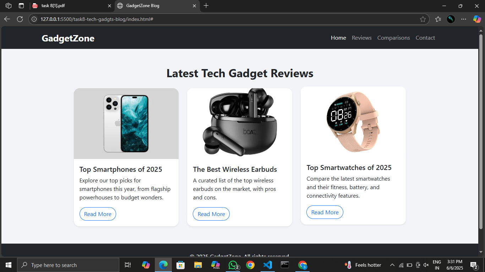

# GadgetZone Bootstrap Blog

A responsive tech blog layout built using **Bootstrap 5**, featuring a modern design with a navbar, blog cards, and a footer. Ideal for gadget reviews, comparisons, and tech news.

---

## 🚀 Features

- Responsive design using Bootstrap 5 grid system
- Navbar with brand and navigation links
- Blog cards with images, titles, descriptions, and buttons
- Footer with social media icons
- Mobile-first and optimized for all screen sizes
- Clean UI with Bootstrap utility classes and custom styles

---

## 🛠️ Tools & Technologies

- HTML5
- CSS3
- [Bootstrap 5.3.3](https://getbootstrap.com/)
- [Bootstrap Icons](https://icons.getbootstrap.com/)
- VS Code
- Web browser

---
## 📸 Preview

 

---
## 📱 Responsive Design

The layout is fully responsive and works seamlessly on:
- Mobile phones
- Tablets
- Desktops

